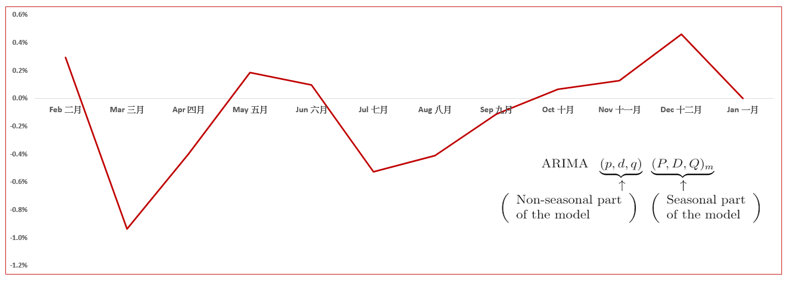
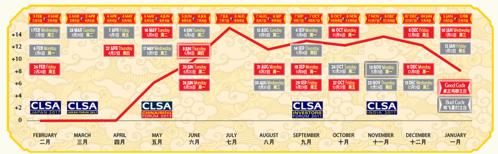
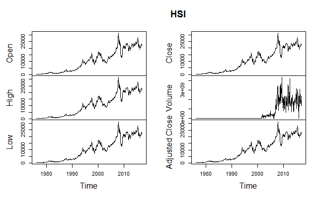
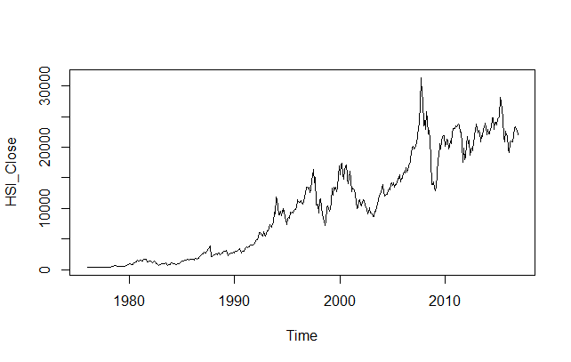

## Introduction
This repository is created to predict Hang Seng Index 恆生指數 in 2017 using ARIMA Modelling in comparison with CLSA Feng Shui Index available on <https://www.clsa.com/special/fsi/2017/>


## Summary

&nbsp; 

#### Result

According to the ARIMA Modelling, December is expected to see the highest momentum of Hang Seng Index. In contrast, CLSA Feng Shui Index predicts July reach its peak.


ARIMA Modelling Prediction


&nbsp; 

CLSA Feng Shui Index <https://www.clsa.com/special/fsi/2017/>


&nbsp; 


#### Analysis: What is ARIMA (Autoregressive Integrated Moving Average) Time Series Modelling

I used Hang Seng Index from 1976 to 2016 sourced from Quandl and then let the package Forecast::auto.arima do the job for us for the ARIMA modelling.
This quick model analysis could suffer from overfitting.
&nbsp;

ARIMA (Autoregressive Integrated Moving Average) is a time series model that attempts to separate the signal from the noise and the signal is then extrapolated into the future to obtain forecasts.
The model consist of lags of the dependent variable, with an autoregressive (AR) component, a moving averages (MA) component and differencing to achieve stationarity (Integration), whose statistical properties including the mean, variance and the autocorrelations for any lag k of the series do not change over time.

In MA model, noise / shock quickly vanishes with time while the AR model has a much lasting effect of the shock.

A seasonal ARIMA model is classified as an “ARIMA(p,d,q)x(P,D,Q)” model, where:
p is the number of autoregressive terms,
d is the number of nonseasonal differences needed for stationarity,
q is the number of lagged forecast errors in the prediction equation,
P is the number of seasonal autoregressive terms,
D is the number of seasonal differences,
Q is the number of seasonal moving average terms.


## 1. Key Questions

* When to buy?
CLSA says during the period of April and July is expected on the rise while ARIMA says Sep to Dec up.

## 2. Problem Solving

####2.1 Data Collection - Hang Seng Index from Quandl 
Quandl
<https://www.quandl.com/>


```{r Data Collection Hang Seng Index - Quandl , echo=TRUE, eval=FALSE, message=FALSE, warning=FALSE}

library(Quandl)
HSI = Quandl("YAHOO/INDEX_HSI" , start_date="1976-01-01",end_date="2016-12-31" , collapse="monthly",type= "ts")
plot(HSI)

HSI_data <- as.data.frame(HSI)
HSI_data_Close <- HSI_data$Close

#Add Time dimension
library(dse)
starttime=c(1976,1)
endtime=c(2016,12)
freq=12 #monthly data

HSI_Close <- ts(HSI_data_Close, start = starttime, end = endtime, frequency = freq)
plot(HSI_Close)

```


Historical Hang Seng Index Movement



&nbsp; 

####2.2 Analysis Results - ARIMA Modelling
```{r ARIMA Modelling , echo=TRUE, eval=FALSE, message=FALSE, warning=FALSE}


library(forecast)
fit <- auto.arima(HSI_Close)
summary(fit)
fitted(fit)
HSI_2017 <- forecast(fit, 13)
HSI_2017 <- HSI_2017$mean

HSI_2017_growth <- HSI_2017/lag(HSI_2017,-1) -1

#Function for percentage calculation 
percent <- function(x, digits = 2, format = "f", ...) {
  paste0(formatC(100 * x, format = format, digits = digits, ...), "%")
}

HSI_2017_growth <- percent(HSI_2017_growth)
```